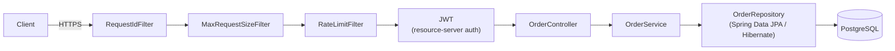
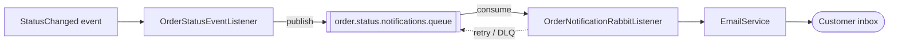
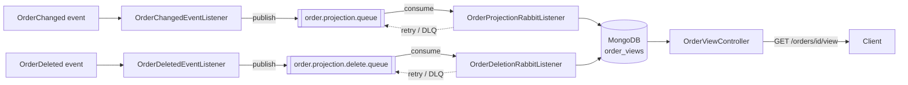

# spring-order-api

[](https://github.com/ronybrand/spring-order-api/actions/workflows/ci.yml)
[](https://github.com/ronybrand/spring-order-api/actions/workflows/codeql.yml)

Order management API (Customer / Order / Item) in Spring Boot, specified in
[`DOMAIN.md`](./DOMAIN.md) and built as complete use cases per resource, following the
conventions documented in `AGENTS.md` and the `spring-feature` skill (local, not versioned - see
below). For the full endpoint list, see
[DOMAIN.md § Reference endpoints](./DOMAIN.md#8-reference-endpoints-original-implementations-http-contract).

## Request &amp; notification flow

**Order create/update (synchronous)**



OrderService publishes a `StatusChanged` event ⤵

**Notification (asynchronous)**



Creating or updating an order runs synchronously through `RequestIdFilter`, `MaxRequestSizeFilter`
and `RateLimitFilter` (in that `@Order` precedence), then Spring Security's JWT resource-server
filter, into the controller, `OrderService`, and the repository/database - the controller returns
the response once `OrderService` finishes (`201` for create, `200` for update). A status change
from `confirm` or `cancel` (not every update) also fires an in-process event; a listener
re-publishes it onto a RabbitMQ queue, drained by a separate consumer (with its own retry) that
sends the email. The two paths never block each other.

The messages in both RabbitMQ flows are covered by **consumer-driven contracts** (Pact JVM message
pacts), not just assumptions shared by convention. `OrderStatusMessagePactConsumerTest` and
`OrderProjectionMessagePactConsumerTest` declare the shapes their real listeners need and feed
pact-generated messages into those listeners; their corresponding provider tests verify the actual
producer output built with the same `JacksonJsonMessageConverter` `RabbitTemplate` uses in
production. Consumers run in Surefire and providers run afterward in Failsafe, because providers
read the pact files generated under `target/pacts/`. `./mvnw verify` runs both without a broker -
see [ADR 0005](./docs/adr/0005-message-pact-without-broker.md) for why.

Sending an email isn't naturally idempotent the way the read-model's Mongo upsert is - a RabbitMQ
redelivery of an already-processed message would otherwise duplicate the email to the customer.
`OrderNotificationRabbitListener` guards this with a Redis idempotency key
(`notification:sent:{orderId}:{newStatus}`), written only *after* the send succeeds so a message
that ends up retried/DLQ'd is never wrongly marked as already sent.

**Order view (CQRS read-model, asynchronous)**



A second, purely technical event - `OrderChangedEvent`, unconditional, unlike the business-gated
`OrderStatusChangedEvent` above - fires from every mutating `OrderService` method except `delete`
(create, item changes, confirm, cancel), carrying a full snapshot of the order (built from the
same managed entity `OrderService` just saved, inside the original transaction - no re-fetch).
`OrderChangedEventListener` just forwards that snapshot onto its own RabbitMQ exchange/queue,
isolated from the notification topology. `OrderProjectionRabbitListener` upserts it into MongoDB
as an `OrderView` document - denormalized, `@Version`-free (last-write-wins is an accepted
trade-off for a disposable projection), served back through `GET /orders/{id}/view`. Eventually
consistent: a `404` right after a write can mean the projection just hasn't caught up yet, not
that the order doesn't exist.

`delete` has its own counterpart, `OrderDeletedEvent`: the order is gone, not changed, so there's
no snapshot to carry - `OrderDeletedEventListener` publishes just the id onto a dedicated
routing key on the same exchange, and `OrderDeletionRabbitListener` deletes the `OrderView`
document outright, same retry/DLQ contract as the upsert path.

## Stack

- Java 25, Spring Boot 4.1, Maven (wrapper included: `./mvnw`)
- PostgreSQL + Liquibase (formatted SQL) + Spring Data JPA / Hibernate
- MongoDB + Spring Data MongoDB (order view read-model)
- Redis (notification idempotency key)
- Spring Security + OAuth2 Resource Server (Keycloak)
- RabbitMQ + Mailpit (order status-change notifications and view projection)
- JUnit 5 + Mockito + AssertJ + Testcontainers + Pact JVM

## Quick demo (Docker only)

No local Java/Maven install needed - builds the app image and brings up the entire stack
(Postgres, MongoDB, Redis, RabbitMQ, Keycloak pre-provisioned with a realm/client/roles/user via
[`keycloak/realm-export.json`](./keycloak/realm-export.json), and the packaged app itself):

```bash
docker compose up -d --build
```

The API comes up at `http://localhost:8080/api` (give it a minute on first run - a fresh Keycloak
realm import takes longer than the app's first connection attempt, so `app` is configured to
restart automatically until Keycloak is ready). Get a token and call a protected endpoint:

```bash
TOKEN=$(docker run --rm --network spring-order-api_default curlimages/curl -sS -X POST \
  http://keycloak:8080/realms/orderapi/protocol/openid-connect/token \
  -d grant_type=password -d client_id=order-api -d client_secret=order-api-secret \
  -d username=demo -d password=demo123 | sed -n 's/.*"access_token":"\([^"]*\)".*/\1/p')

curl -H "Authorization: Bearer $TOKEN" http://localhost:8080/api/orders/search
```

(The token request runs through a throwaway container on the same Docker network, resolving
`keycloak` the same way the `app` service does - Keycloak's issuer is derived from the request's
own host/port, so this needs to go through the same address the `app` service uses internally,
not the host-published port. See the `KC_HOSTNAME` comment in `docker-compose.yml`.)

`demo`/`demo123` (realm roles `USER` and `ADMIN`) is the only user provisioned this way - it
exists solely for this demo/local-dev convenience and only in this local Postgres-backed Keycloak
instance, never anything to reuse anywhere real.

## Running locally (hot reload)

Day-to-day development runs the app directly instead, for fast rebuild/reload - only the
dependencies come from Docker:

```bash
docker compose up -d postgres keycloak keycloak-db rabbitmq mongo redis
./mvnw spring-boot:run -Dspring-boot.run.profiles=dev
```

The API comes up at `http://localhost:8080/api`. Keycloak is pre-provisioned the same way as the
quick demo above (same realm/client/`demo` user) - since the app now runs directly on the host
rather than in the Docker network, request it through the published port instead:
`http://localhost:8085/realms/orderapi/protocol/openid-connect/token` (same grant/params as
above). This matches `OAUTH2_ISSUER_URI`'s default in `application.yml`, since Keycloak's issuer
follows whichever host/port a request actually came in on.

### API documentation (Swagger)

**Disabled by default** outside the `dev` profile - enforced by `SwaggerDisabledByDefaultTest`,
which reads the real `application.yml` rather than relying on manual review, so the full API
schema is never exposed in production by accident. With the `dev` profile active (either flow
above):

- **Swagger UI:** `http://localhost:8080/api/swagger-ui.html`
- **OpenAPI JSON:** `http://localhost:8080/api/v3/api-docs`

## Configuration &amp; deployment notes

Everything under `spring:` in `application.yml` is sourced from environment variables with
local-dev defaults (`localhost`, `guest`/`guest`, etc.) - see the `${VAR:default}` pattern
throughout. There is no secrets file to copy or `.env` to fill in for local development; the
defaults match `docker-compose.yml` out of the box.

This does **not** mean production would run the same way:

- **TLS**: this application does not terminate TLS itself. In a real deployment it's expected to
  sit behind a reverse proxy / ingress / load balancer (e.g. an Nginx ingress, a cloud load
  balancer, or a service mesh sidecar) that handles certificates and forwards plain HTTP
  internally - the standard pattern for a containerized Spring Boot service, not something this
  repository configures.
- **Secrets**: environment variables are the right mechanism for *injecting* configuration into a
  container regardless of environment - what changes in production is *where those values come
  from*. Locally they're plain defaults; in a real deployment they'd be populated by the
  platform's secret store (Kubernetes `Secret`s, a cloud secrets manager, etc.) rather than
  committed anywhere - this repository intentionally contains no production credentials to rotate.

See [SECURITY.md](./SECURITY.md) for the vulnerability-reporting policy.

## Tests

```bash
./mvnw test      # unit (*Test, no Docker)
./mvnw verify    # unit + integration (*IT, real Postgres via Testcontainers) + PMD + JaCoCo
```

`./mvnw test` runs the Pact JVM consumer tests and writes the local contracts to `target/pacts/`.
`./mvnw verify` then runs the provider verifications in Failsafe, together with the integration
tests. The notification pair is
`OrderStatusMessagePactConsumerTest`/`OrderStatusMessagePactProviderTest`; the projection pair is
`OrderProjectionMessagePactConsumerTest`/`OrderProjectionMessagePactProviderTest`. See [ADR 0005](./docs/adr/0005-message-pact-without-broker.md).

`./mvnw verify` runs automatically in CI (GitHub Actions) on every push/PR to `main` - see
`.github/workflows/ci.yml`. JaCoCo coverage gate: 80% line / 65% branch (excludes
`commons/config` and the bootstrap class, which are framework wiring, not business logic).

CI also runs **CodeQL** static analysis on every PR and weekly on `main`
(`.github/workflows/codeql.yml`), and **Dependabot** keeps Maven and GitHub Actions dependencies
current via weekly grouped PRs (`.github/dependabot.yml`).

## Sensitive data

Fields classified as PII (e.g. `Customer.taxId`, `Customer.passportNumber`, `Customer.email`)
are annotated with `@Sensitive` (`commons/security/Sensitive.java`). `SensitiveDataMasker`
masks them (`***REDACTED***`) in the reflection-based `toString()` used by entities/logs, and
`SensitiveFieldsModule` is a Jackson safety net that masks the same fields if an entity is ever
serialized directly instead of going through a DTO (the project convention). Adding a new
sensitive field only requires annotating it - no manual exclusion needed.

## Structure

Package by feature (not by layer) - `customer/` and `order/` each contain their
entity/controller/service/repository/DTOs/specification together; `order/readmodel/` holds the
MongoDB CQRS read-model (its own RabbitMQ topology, consumer, and `GET /orders/{id}/view`
endpoint); `notification/` holds the RabbitMQ/email flow for order status-change events;
cross-cutting code lives in `commons/`. Full convention details: the `spring-feature` skill
(`.claude/skills/spring-feature/SKILL.md`, local/gitignored) and `AGENTS.md` (versioned
summary checklist).

## Architecture decisions

Non-obvious technical decisions (and the alternatives considered) are logged in
[`docs/adr/`](./docs/adr/README.md) as Architecture Decision Records.
