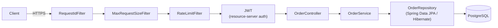

# spring-order-api

[](https://github.com/ronybrand/spring-order-api/actions/workflows/ci.yml)
[](https://github.com/ronybrand/spring-order-api/actions/workflows/codeql.yml)

Order management API (Customer / Order / Item) in Spring Boot, specified in
[`DOMAIN.md`](./DOMAIN.md) and built as complete use cases per resource, following the
conventions documented in `AGENTS.md` and the `spring-feature` skill (local, not versioned - see
below). For the full endpoint list, see
[DOMAIN.md § Reference endpoints](./DOMAIN.md#8-reference-endpoints-original-implementations-http-contract).

## Request &amp; notification flow

**Order create/update (synchronous)**



OrderService publishes a `StatusChanged` event ⤵

**Notification (asynchronous)**


Creating or updating an order runs synchronously through `RequestIdFilter`, `MaxRequestSizeFilter`
and `RateLimitFilter` (in that `@Order` precedence), then Spring Security's JWT resource-server
filter, into the controller, `OrderService`, and the repository/database - the controller returns
the response once `OrderService` finishes (`201` for create, `200` for update). A status change
from `confirm` or `cancel` (not every update) also fires an in-process event; a listener
re-publishes it onto a RabbitMQ queue, drained by a separate consumer (with its own retry) that
sends the email. The two paths never block each other.

The shape of that `order.status.notifications.queue` message is a **consumer-driven contract**
(Pact JVM message pact), not just an assumption shared by convention: `OrderStatusMessagePactConsumerTest`
declares, from `OrderNotificationRabbitListener`'s point of view, what it needs to parse the
message and feeds a pact-generated message straight into the real listener; `OrderStatusMessagePactProviderTest`
then verifies that the actual producer output - built with the same `JacksonJsonMessageConverter`
`RabbitTemplate` uses in production, not a hand-rolled serializer - satisfies that contract. Both
run as part of `./mvnw verify`, no broker required (the generated pact file lives under
`target/pacts/`) - see [ADR 0005](./docs/adr/0005-message-pact-without-broker.md) for why.

## Stack

- Java 25, Spring Boot 4.1, Maven (wrapper included: `./mvnw`)
- PostgreSQL + Liquibase (formatted SQL) + Spring Data JPA / Hibernate
- Spring Security + OAuth2 Resource Server (Keycloak)
- RabbitMQ + Mailpit (order status-change notifications)
- JUnit 5 + Mockito + AssertJ + Testcontainers

## Running locally

```bash
docker compose up -d postgres keycloak keycloak-db
./mvnw spring-boot:run -Dspring-boot.run.profiles=dev
```

The API comes up at `http://localhost:8080/api`.

### API documentation (Swagger)

**Disabled by default** outside the `dev` profile - enforced by `SwaggerDisabledByDefaultTest`,
which reads the real `application.yml` rather than relying on manual review, so the full API
schema is never exposed in production by accident. With `-Dspring-boot.run.profiles=dev`:

- **Swagger UI:** `http://localhost:8080/api/swagger-ui.html`
- **OpenAPI JSON:** `http://localhost:8080/api/v3/api-docs`

### Keycloak (first time)

`docker-compose.yml` only starts Keycloak - the realm/client/roles are not provisioned
automatically yet. To test manually against the real server (the automated `*ControllerIT` tests
**don't** need this, they use a local RSA key pair):

1. Admin console at `http://localhost:8085` (`admin`/`admin`).
2. Create an `orderapi` realm, a confidential client with audience `order-api`, and the realm
   roles `USER`/`ADMIN`.
3. Create a test user with those roles and obtain a token via
   `POST /realms/orderapi/protocol/openid-connect/token` (`password` or `client_credentials`
   grant, depending on how the client is configured).

## Tests

```bash
./mvnw test      # unit (*Test, no Docker)
./mvnw verify    # unit + integration (*IT, real Postgres via Testcontainers) + PMD + JaCoCo
```

`./mvnw verify` runs automatically in CI (GitHub Actions) on every push/PR to `main` - see
`.github/workflows/ci.yml`. JaCoCo coverage gate: 80% line / 65% branch (excludes
`commons/config` and the bootstrap class, which are framework wiring, not business logic).

CI also runs **CodeQL** static analysis on every PR and weekly on `main`
(`.github/workflows/codeql.yml`), and **Dependabot** keeps Maven and GitHub Actions dependencies
current via weekly grouped PRs (`.github/dependabot.yml`).

## Sensitive data

Fields classified as PII (e.g. `Customer.taxId`, `Customer.passportNumber`, `Customer.email`)
are annotated with `@Sensitive` (`commons/security/Sensitive.java`). `SensitiveDataMasker`
masks them (`***REDACTED***`) in the reflection-based `toString()` used by entities/logs, and
`SensitiveFieldsModule` is a Jackson safety net that masks the same fields if an entity is ever
serialized directly instead of going through a DTO (the project convention). Adding a new
sensitive field only requires annotating it - no manual exclusion needed.

## Structure

Package by feature (not by layer) - `customer/` and `order/` each contain their
entity/controller/service/repository/DTOs/specification together; `notification/` holds the
RabbitMQ/email flow for order status-change events; cross-cutting code lives in `commons/`. Full
convention details: the `spring-feature` skill
(`.claude/skills/spring-feature/SKILL.md`, local/gitignored) and `AGENTS.md` (versioned
summary checklist).

## Architecture decisions

Non-obvious technical decisions (and the alternatives considered) are logged in
[`docs/adr/`](./docs/adr/README.md) as Architecture Decision Records.
